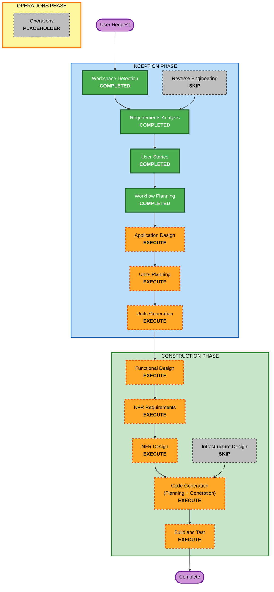

# Execution Plan

## Detailed Analysis Summary

### Change Impact Assessment

- **User-facing changes**: Yes. The project creates sign-up, verification, sign-in, recovery, sign-out, and protected dashboard journeys.
- **Structural changes**: Yes. The repository will contain two top-level applications: `web` for NuxtJS and `api` for NestJS.
- **Data model changes**: Yes. PostgreSQL/Prisma schema is required for users, refresh tokens, verification tokens, and password reset tokens.
- **API changes**: Yes. New REST endpoints are required for auth lifecycle operations.
- **NFR impact**: Yes. Cookie security, token expiration, password hashing, CORS, validation, local setup, and testability affect the design.

### Risk Assessment

- **Risk Level**: Medium.
- **Rollback Complexity**: Moderate. This is greenfield, but auth touches many surfaces and data models.
- **Testing Complexity**: Moderate. Backend unit/e2e tests and frontend page/component tests are required.

### Component Relationships

- **Frontend Web App**: NuxtJS pages, route protection, auth API client, and auth state.
- **Backend API App**: NestJS auth module, user persistence, token services, email service, validation, and guards.
- **Database**: PostgreSQL accessed through Prisma migrations and client.
- **SMTP Provider**: External email delivery dependency configured by environment variables.

## Workflow Visualization

Text alternative: Workspace Detection, Requirements Analysis, User Stories, and Workflow Planning are complete. Application Design, Units Planning, Units Generation, Functional Design, NFR Requirements, NFR Design, Code Generation, and Build and Test will execute. Reverse Engineering, Infrastructure Design, and Operations are skipped or placeholder stages.

## Phases to Execute

### INCEPTION PHASE

- [x] Workspace Detection - COMPLETED
- [x] Reverse Engineering - SKIPPED
  - **Rationale**: The project is greenfield and has no existing application code.
- [x] Requirements Analysis - COMPLETED
- [x] User Stories - COMPLETED
- [x] Workflow Planning - COMPLETED
- [ ] Application Design - EXECUTE
  - **Rationale**: New frontend, backend, email, persistence, and auth-session components need clear boundaries.
- [ ] Units Planning - EXECUTE
  - **Rationale**: Work spans `web` and `api`, with shared story coverage and integration dependencies.
- [ ] Units Generation - EXECUTE
  - **Rationale**: Units are needed to map stories to development order and construction design.

### CONSTRUCTION PHASE

- [ ] Functional Design - EXECUTE
  - **Rationale**: Auth flows need detailed behavior for registration, verification, sign-in, refresh, recovery, route protection, and sign-out.
- [ ] NFR Requirements - EXECUTE
  - **Rationale**: Cookie/session handling, password hashing, validation, CORS, SMTP, and local setup require explicit requirements.
- [ ] NFR Design - EXECUTE
  - **Rationale**: NFR decisions must be incorporated before implementation.
- [ ] Infrastructure Design - SKIP
  - **Rationale**: No production deployment target, cloud resources, or infrastructure-as-code requirements were selected.
- [ ] Code Generation - EXECUTE
  - **Rationale**: Application code, schemas, tests, and configuration are required.
- [ ] Build and Test - EXECUTE
  - **Rationale**: Generated Nuxt/Nest code must build and pass relevant tests.

### OPERATIONS PHASE

- [ ] Operations - PLACEHOLDER
  - **Rationale**: AI-DLC operations workflow is reserved for future deployment and monitoring work.

## Execution Sequence

1. Application Design
2. Units Planning
3. Units Generation
4. Functional Design
5. NFR Requirements
6. NFR Design
7. Code Generation
8. Build and Test

## Estimated Timeline

- **Total Remaining Stages**: 8
- **Estimated Duration**: Medium, suitable for iterative implementation in the current workspace.

## Success Criteria

- **Primary Goal**: A working NuxtJS and NestJS email authentication flow.
- **Key Deliverables**:
  - Nuxt auth pages and protected dashboard.
  - NestJS auth API with Prisma/PostgreSQL persistence.
  - SMTP-backed verification and password reset emails.
  - HTTP-only cookie session flow with JWT access and refresh tokens.
  - Backend auth unit/e2e tests and basic Nuxt tests.
  - Local setup documentation and environment examples.
- **Quality Gates**:
  - Requirements and stories remain traceable to implementation.
  - Generated code builds.
  - Auth tests cover sign-up, verification, sign-in, blocked unverified sign-in, recovery, protected access, and sign-out.
  - No application code is placed under `aidlc-docs/`.
